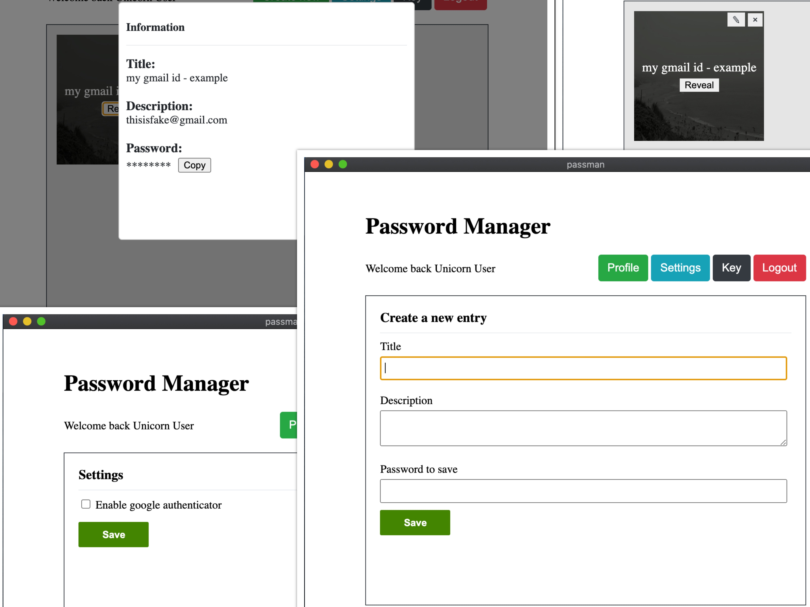

# Password Manager

Password manager is a cross-platform desktop app to manage personal passwords, secret information and confidential textual information. It is built on top of <a href="http://electron.atom.io" target="_blank">Electron</a>. It is built using cipher encryption algorithms, steganography, and google authenticator.

:star: Star us on GitHub — it helps!

## Table of content
- [How it works?](#how-it-works)
- [Key Features](#key-features)
- [Download](#download)
	- [Mac](https://github.com/hasukmistry/password-manager/raw/master/mac/passman-1.0.0.dmg)
	- [Ubuntu](https://github.com/hasukmistry/password-manager/raw/master/ubuntu/passman_1.0.0_amd64.deb)
	- [Windows](https://github.com/hasukmistry/password-manager/raw/master/windows/passman%201.0.0.msi)
- [License](#license)
- [Support](#support)

## How it works?
Password Manager - An Introduction - [Watch it on youtube](https://youtu.be/mtkNmCAG0Rg)

## Key Features
* Three layered secure encryption.
* Encryption using [Steganography](https://en.wikipedia.org/wiki/Steganography) and [Cipher Algorithm](https://en.wikipedia.org/wiki/Cipher).
* Supports portability for encrypted data.
* Supports [Google Authenticator](https://www.google.com/landing/2step/#tab=how-it-works).
* Cross platform
  - Mac, Ubuntu and Windows ready.

## Download
Currently Password Manager is available to download for Mac, Ubuntu and Windows.

## Credits
This software is built using following open source packages:
- [Electron](http://electron.atom.io/)
- [Node.js](https://nodejs.org/)
- [Vue.js](https://vuejs.org/)
- [Express](https://expressjs.com/)
- [Otplib](https://github.com/yeojz/otplib)
- [SQLite](https://www.sqlite.org/index.html)
- [Google Authenticator](https://www.google.com/landing/2step/#tab=how-it-works)
- [Flaticon](https://www.flaticon.com/)
- [Picsum Photos](https://picsum.photos/)

## License
Password manager is licensed under the terms of the GPL Open Source license and is available for free.

## Support

OR

